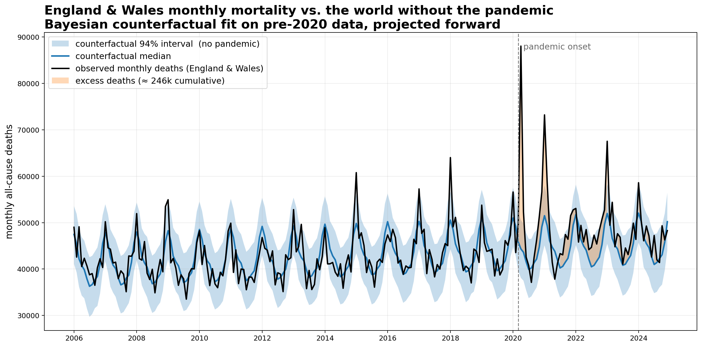
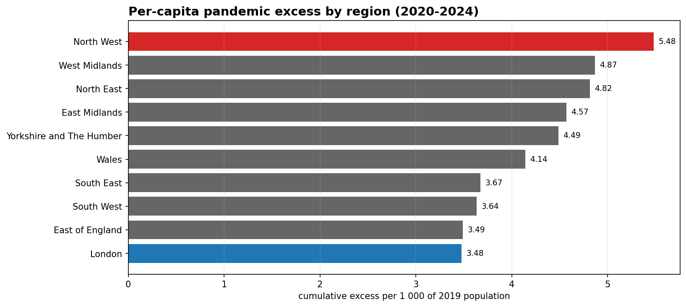
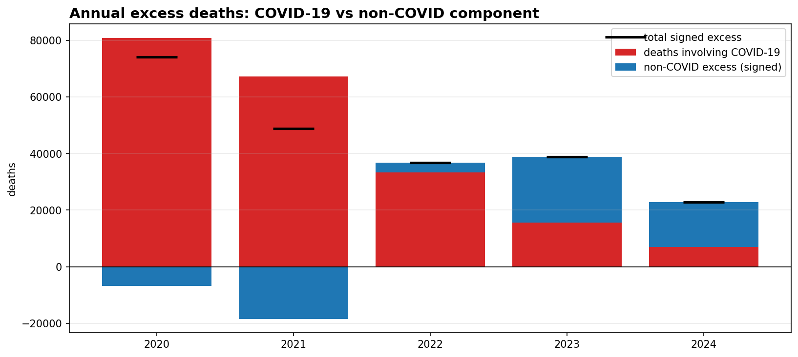
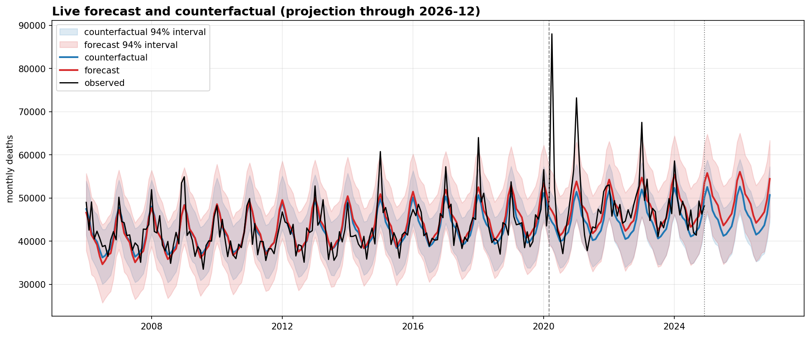

# ONS Mortality Counterfactual

Python project that downloads the ONS *Monthly figures on deaths registered by area of usual residence* workbooks, extracts the England & Wales national series, and fits a pre-pandemic counterfactual to estimate excess mortality from March 2020 onwards.

The repository ships with two paths:

- **No-MySQL path (recommended).** A single CLI command (`ons-mortality run`) downloads every annual ONS workbook, parses both the legacy wide-format and the 2023+ long-format layouts, writes a tidy CSV, fits the counterfactual, and saves the chart.
- **MySQL path.** The original ingestion pipeline that stores raw source-file metadata and a normalized `monthly_deaths` table in MySQL via Docker. Useful when the project's data needs to be queried alongside other datasets.



## What this repository does

1. Discovers ONS annual mortality workbooks from the public dataset page.
2. Downloads them with on-disk caching and polite throttling (the ONS site rate-limits aggressive clients).
3. Extracts the England & Wales national monthly series. Two layouts are supported:
   - 2006-2022 — wide format with one column per month and a "pyramid" admin hierarchy.
   - 2023+ — long format with columns ``Month``, ``Code``, ``Geography``, ``Number of deaths``.
4. When a final edition supersedes a provisional one, the more authoritative figure wins.
5. Fits a Bayesian-style linear regression (linear trend + annual Fourier seasonality, conjugate Gaussian posterior) on data strictly before March 2020.
6. Projects the no-pandemic trajectory forward and computes excess deaths against the counterfactual median.
7. Optionally loads everything into MySQL for downstream querying.

## Project structure

```text
ons-mortality-counterfactual/
├── docker-compose.yml
├── pyproject.toml
├── requirements.txt
├── .env.example
├── Makefile
├── sql/
│   └── schema.sql
├── src/
│   └── ons_mortality/
│       ├── __init__.py
│       ├── cli.py
│       ├── config.py
│       ├── counterfactual.py
│       ├── database.py
│       ├── fetch.py
│       ├── ons.py
│       └── parser.py
├── scripts/
│   └── make_counterfactual_plot.py
├── notebooks/
│   └── 01_counterfactual_mortality.ipynb
├── tests/
│   ├── test_counterfactual.py
│   ├── test_fetch.py
│   ├── test_ons.py
│   └── test_parser.py
├── data/
│   ├── raw/        # cached ONS workbooks
│   └── processed/  # tidy CSV exports
└── figures/        # rendered charts
```

## Requirements

- Python 3.10+
- One of:
  - Poetry (recommended), or
  - `pip` with `requirements.txt`
- Docker + Docker Compose (only for the MySQL path)
- Internet access to download the ONS Excel files

## Quick start (no MySQL)

```bash
poetry install   # or: pip install -r requirements.txt && pip install -e .

poetry run ons-mortality run --start-year 2006 --end-year 2024
```

This single command:

- downloads ~19 annual workbooks into `data/raw/` (cached on subsequent runs),
- extracts the England & Wales monthly series into `data/processed/england_wales_monthly_deaths.csv`,
- fits the counterfactual,
- saves the chart to `figures/england_wales_counterfactual.png`.

If you want the data without the chart, use:

```bash
poetry run ons-mortality fetch --start-year 2006 --end-year 2024
```

If you already have the CSV and just want to refit / replot:

```bash
poetry run ons-mortality plot \
    --input data/processed/england_wales_monthly_deaths.csv \
    --output figures/england_wales_counterfactual.png \
    --fourier-order 3 --interval-mass 0.94
```

## Quick start (with MySQL)

```bash
cp .env.example .env
docker compose up -d
poetry install

poetry run ons-mortality init-db
poetry run ons-mortality discover --start-year 2006 --end-year 2024
poetry run ons-mortality ingest   --start-year 2006 --end-year 2024
poetry run ons-mortality export-national \
    --output data/processed/england_wales_monthly_deaths.csv
poetry run ons-mortality plot
```

## Notebooks

The repository ships three notebooks, each producing reproducible figures from the cached CSVs.

**[`01_counterfactual_mortality.ipynb`](notebooks/01_counterfactual_mortality.ipynb)** — the headline analysis.

1. Data load + shape checks
2. Seasonality and slow-trend decomposition
3. Year × month heatmap
4. Counterfactual fit
5. Monthly + cumulative excess deaths
6. Residual diagnostics
7. Sensitivity to the Fourier order
8. Demographic decomposition: how much of the pre-pandemic trend is population growth vs ageing vs per-person risk

Cumulative excess (2020-2024): **~245 000**.

**[`02_regional_excess.ipynb`](notebooks/02_regional_excess.ipynb)** — sub-national breakdown.

Refits the same model independently for the 9 English regions plus Wales, and ranks them by per-capita pandemic excess. The absolute and per-capita rankings disagree sharply: London tops the absolute table but is near the bottom per capita, while the North West tops the per-capita table at 5.48 excess deaths per 1 000.



Run `ons-mortality fetch-regional` first to build the input CSV.

**[`03_negative_binomial_glm.ipynb`](notebooks/03_negative_binomial_glm.ipynb)** — count model with population offset.

Refits the counterfactual as a negative binomial GLM with `log(population)` as an offset, so the model directly estimates per-capita monthly risk. Cumulative excess under this model: **~282 000** — about 15% higher than the Gaussian linear model in notebook 01. Both numbers are defensible; the gap is the difference between projecting absolute deaths at their historical slope vs holding per-capita risk near constant. Requires `statsmodels`.

**[`04_age_standardized_rate.ipynb`](notebooks/04_age_standardized_rate.ipynb)** — age-standardised mortality rate (ASMR).

The rigorous version of section 9 in notebook 01. Demonstrates the ESP-2013 weighting on a worked example, then loads the published ONS ASMR series for E&W (2006-2023), refits the counterfactual on the rate, and translates back to absolute deaths. Pre-pandemic ASMR was falling at **~1.4% per year**; the implied 2020-2023 cumulative excess is **~281 000 deaths**, agreeing closely with notebook 03's NB GLM and disagreeing with notebook 01's Gaussian-linear by ~15%. The takeaway: simple absolute-count models systematically understate excess because they absorb demographic uplift into their trend.

**[`05_weekly_mortality.ipynb`](notebooks/05_weekly_mortality.ipynb)** — weekly resolution.

Refits the counterfactual on the ONS weekly registrations dataset (2010-2024, 782 weeks). Pinpoints the **first-wave peak at 22 351 deaths in the week ending 17 April 2020** — roughly 2× the counterfactual for that week. Surfaces the **Christmas/New Year reporting artefact** that monthly aggregates hide (week 1 sits ~12% below trend, week 2 ~12% above, due to bank-holiday registration delays). Cumulative weekly excess (clipped) comes in ~36k below the monthly figure because clipping discards more deficit weeks at higher resolution; signed excess agrees within a few percent.

Run `ons-mortality fetch-weekly` first to build the input CSV.

**[`06_cause_decomposition.ipynb`](notebooks/06_cause_decomposition.ipynb)** — COVID-19 vs non-COVID excess.

Decomposes the year-by-year excess into direct COVID-19 deaths and non-COVID residual. Two distinct regimes: in **2020–2021 COVID-19 over-explains the excess** (lockdowns suppressed flu, road accidents, and other typical killers, so non-COVID mortality fell). In **2022 the split is roughly 80/20**. By **2023–2024 COVID-19 explains only ~30%** of excess; the residual ~20 000 deaths/year is attributable elsewhere (delayed treatment, NHS pressure, post-acute pandemic effects). Cumulative split: ~204k COVID-19 + ~42k non-COVID = ~246k total.



**[`07_live_forecast.ipynb`](notebooks/07_live_forecast.ipynb)** — forward projection.

Two projections share one design matrix: the **counterfactual** trained on pre-2020 data only, and the **forecast** trained on all observed months. Both project 24 months past the latest ONS edition. The gap between them implies a **structural \"new normal\" elevation of ~35–40 thousand deaths per year** through 2026 — close to the recent post-pandemic excess running rate. Includes an "is the latest month inside the forecast 94% interval?" check that's the natural anchor for monitoring fresh ONS publications.



## Continuous refresh

[`.github/workflows/refresh-live-forecast.yml`](.github/workflows/refresh-live-forecast.yml) re-runs the live forecast on a monthly schedule (the 25th, 02:00 UTC — a day after ONS typically publishes the new edition). The workflow:

1. Sets up Python 3.12 and installs the package.
2. Runs `ons-mortality fetch` to pull the latest ONS monthly mortality data.
3. Re-executes notebook 01 (headline counterfactual) and notebook 07 (live forecast) in place.
4. Commits the refreshed CSV, figures, and notebook outputs back to `main` if anything changed.

Trigger it manually from the Actions tab via *Run workflow* — useful for one-off refreshes or testing.

## Database tables

The `init-db` and `ingest` commands populate two tables:

- **`ons_source_files`** — one record per downloaded workbook (`edition_year`, `source_url`, `local_filename`, `file_sha256`, `downloaded_at`).
- **`monthly_deaths`** — normalized rows (`source_file_id`, `edition_year`, `month_date`, `area_code`, `area_name`, `geography_type`, `deaths`, `is_final`).

Schema is defined in [`sql/schema.sql`](sql/schema.sql).

## Example SQL query (MySQL path only)

```sql
SELECT
    month_date,
    area_code,
    area_name,
    SUM(deaths) AS observed_deaths
FROM monthly_deaths
WHERE area_code = 'K04000001'
   OR LOWER(area_name) IN ('england and wales', 'england & wales')
GROUP BY month_date, area_code, area_name
ORDER BY month_date;
```

## Model

The counterfactual model is a Bayesian-style linear regression with:

- linear trend,
- annual Fourier seasonality (3 harmonics by default),
- posterior sampling from a conjugate Gaussian approximation,
- predictive uncertainty (parameter draws + observation-level Gaussian noise),
- a central credible interval whose mass is configurable (94% by default).

It is fit only on data before March 2020 and projected forward. Read it as a transparent baseline; a more formal version would use a negative-binomial likelihood, an explicit population offset, and a state-space trend.

## Important notes

The ONS workbook layout has changed several times since 2006. The fetch path detects the layout per sheet and falls back from wide to long extraction. Provisional editions are routinely revised, so the cached files have their SHA-256 recorded by the ingest path; rerun `fetch` with `--overwrite` to force a refresh.

## Development

```bash
poetry run pytest -q
poetry run ruff check .
poetry run mypy src
```

## License

ONS data is subject to the [Open Government Licence](https://www.nationalarchives.gov.uk/doc/open-government-licence/version/3/) unless otherwise stated. The Python code is provided as a portfolio example.
