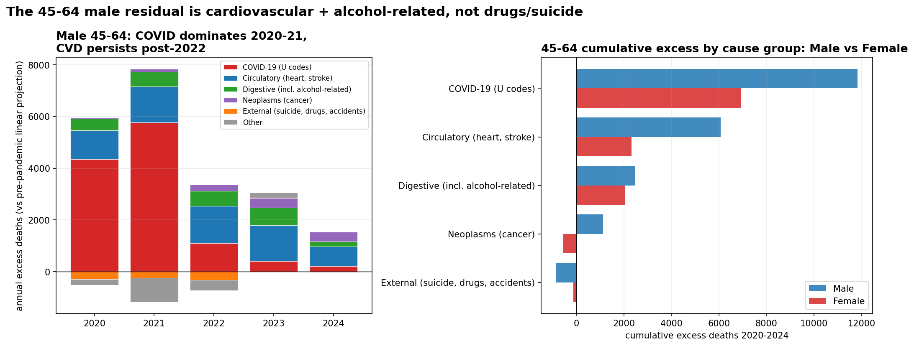

# ONS Mortality Counterfactual

**How big was the England & Wales pandemic, and who is still dying because of it?**

Cumulative excess deaths from March 2020 to December 2024 land in the **~245-285k range**, depending on how the pre-pandemic trend is extrapolated. The acute pandemic phase has largely faded — the 85+ cohort sits at counterfactual by 2024 — but a persistent post-2022 residual remains. It is **concentrated in 45-64 men, and the cause-of-death decomposition shows it is cardiovascular and alcohol-related disease, not drugs or suicide**, flatly contradicting the lay "deaths of despair" narrative.


## Key findings

- **~243-285k cumulative excess deaths in 2020-2024 across three methodologies** — Bayesian linear (243k), negative-binomial GLM (282k), age-standardised mortality rate (281k). The 17% spread is driven entirely by how the pre-pandemic trend is extrapolated; quadratic and per-capita formulations both land near the upper end of the range. *See [`01_counterfactual_mortality.ipynb`](notebooks/01_counterfactual_mortality.ipynb), [`03_negative_binomial_glm.ipynb`](notebooks/03_negative_binomial_glm.ipynb), [`04_age_standardized_rate.ipynb`](notebooks/04_age_standardized_rate.ipynb), [`11_trend_specification.ipynb`](notebooks/11_trend_specification.ipynb).*
- **The 85+ cohort has reverted to baseline by 2024.** Its excess fell ~90% from 2020 (~28k) to 2024 (~3k). The 2024 observed-to-counterfactual ratio is ~1.00 — no displacement undershoot, just reversion. Contradicts the "the elderly are still dying" narrative. *See [`08_age_band_excess.ipynb`](notebooks/08_age_band_excess.ipynb).*
- **The persistent post-2022 residual is middle-aged and predominantly male.** 45-64 male cumulative excess is ~26k vs ~14k female (M:F ratio 1.86×); the gap does not close as the elderly bands revert. By 2024 the residual excess is concentrated in 45-64 men and 75-84 men, not the very elderly. *See [`09_sex_age_excess.ipynb`](notebooks/09_sex_age_excess.ipynb).*
- **The cause is cardiovascular + alcohol-related, not drugs or suicide.** ICD-10 chapter decomposition of Male 45-64 excess: COVID-19 U codes ~+11.8k (61%), circulatory (heart, stroke) ~+6.1k (32%), digestive (incl. alcohol-related liver) ~+2.5k (13%), neoplasms drift +1.1k. **External causes — suicide, drug poisoning, alcohol poisoning, accidents — sit *below* projection** (cumulative ~−0.8k). The "deaths of despair" hypothesis fails the data test for this cohort. *See [`12_cause_decomposition.ipynb`](notebooks/12_cause_decomposition.ipynb).*
- **The model is well-calibrated where it matters.** A 2017-2019 holdout backtest across 32 fits shows nominal 94% credible intervals achieve 89% empirical coverage at the national level (slight under-cover) but 94-100% at the per-(sex × band) level used in the headline findings — meaning the per-band conclusions are well-calibrated. *See [`10_backtest_calibration.ipynb`](notebooks/10_backtest_calibration.ipynb).*

## What this repository is

A reproducible portfolio analysis built around the ONS *Monthly figures on deaths registered by area of usual residence* and *Series DR reference tables* datasets. It ships:

- A **fetcher** that downloads every ONS annual workbook (2006-2024), parses two distinct sheet layouts (legacy wide-format and 2023+ long-format) plus the Series DR cause-of-death table, dedupes provisional/final editions, and writes tidy CSVs.
- A **Bayesian counterfactual model** with three trend specifications (linear / log-linear / quadratic), conjugate Gaussian posterior, and predictive credible intervals.
- **12 notebooks** that progressively decompose the ~245k headline by region, age band, sex × age, and cause of death — each with its own counterfactual fit; the four figures most central to the headline narrative are embedded in this README, the rest live under [`figures/`](figures/).
- **Backtested calibration** (nb 10) and **trend-specification sensitivity analysis** (nb 11), so each headline number comes with a defensible uncertainty range.
- **Optional MySQL ingestion path** with a normalized schema for cross-querying, plus a **monthly GitHub Actions refresh** that pulls fresh ONS data and re-executes the analysis on the 25th of each month.

## Project structure

```text
ons-mortality-counterfactual/
├── docker-compose.yml
├── pyproject.toml
├── requirements.txt
├── .env.example
├── Makefile
├── sql/
│   └── schema.sql
├── src/
│   └── ons_mortality/
│       ├── __init__.py
│       ├── cli.py
│       ├── config.py
│       ├── counterfactual.py    # Bayesian linear model + 3 trend specs
│       ├── database.py
│       ├── fetch.py             # ONS workbook discovery + 4 layout parsers
│       ├── ons.py
│       ├── parser.py
│       └── population.py        # population & ASMR helpers
├── scripts/
│   ├── make_counterfactual_plot.py
│   └── render_readme_figures.py
├── notebooks/
│   ├── 01_counterfactual_mortality.ipynb
│   ├── 02_regional_excess.ipynb
│   ├── 03_negative_binomial_glm.ipynb
│   ├── 04_age_standardized_rate.ipynb
│   ├── 05_weekly_mortality.ipynb
│   ├── 06_cause_decomposition.ipynb       # COVID-19 vs non-COVID
│   ├── 07_live_forecast.ipynb
│   ├── 08_age_band_excess.ipynb           # 7 canonical age bands
│   ├── 09_sex_age_excess.ipynb            # sex × age (14 fits)
│   ├── 10_backtest_calibration.ipynb      # 32-fit holdout test
│   ├── 11_trend_specification.ipynb       # linear / log-linear / quadratic
│   └── 12_cause_decomposition.ipynb       # ICD-10 chapter breakdown
├── tests/
│   ├── test_counterfactual.py
│   ├── test_fetch.py
│   ├── test_ons.py
│   ├── test_parser.py
│   └── test_population.py
├── data/
│   ├── raw/        # cached ONS workbooks
│   └── processed/  # tidy CSV exports (10 datasets)
└── figures/        # 9 rendered charts (4 embedded in this README)
```

## Requirements

- Python 3.10+
- One of:
  - Poetry (recommended), or
  - `pip` with `requirements.txt`
- Docker + Docker Compose (only for the MySQL path)
- Internet access to download the ONS Excel files

## Quick start (no MySQL)

```bash
poetry install   # or: pip install -r requirements.txt && pip install -e .

poetry run ons-mortality run --start-year 2006 --end-year 2024
```

This single command:

- downloads ~19 annual workbooks into `data/raw/` (cached on subsequent runs),
- extracts the England & Wales monthly series into `data/processed/england_wales_monthly_deaths.csv`,
- fits the counterfactual,
- saves the chart to `figures/england_wales_counterfactual.png`.

If you want the data without the chart, use:

```bash
poetry run ons-mortality fetch --start-year 2006 --end-year 2024
```

If you already have the CSV and just want to refit / replot:

```bash
poetry run ons-mortality plot \
    --input data/processed/england_wales_monthly_deaths.csv \
    --output figures/england_wales_counterfactual.png \
    --fourier-order 3 --interval-mass 0.94
```

## Quick start (with MySQL)

```bash
cp .env.example .env
docker compose up -d
poetry install

poetry run ons-mortality init-db
poetry run ons-mortality discover --start-year 2006 --end-year 2024
poetry run ons-mortality ingest   --start-year 2006 --end-year 2024
poetry run ons-mortality export-national \
    --output data/processed/england_wales_monthly_deaths.csv
poetry run ons-mortality plot
```

## Notebooks

The repository ships twelve notebooks, each producing reproducible figures from the cached CSVs. They follow a deliberate arc — the first seven establish the headline national/regional excess and supporting methodology; the last five (08-12) decompose that excess by age, sex, validate the model on a holdout, test trend-specification sensitivity, and decompose by cause of death.

**[`01_counterfactual_mortality.ipynb`](notebooks/01_counterfactual_mortality.ipynb)** — the headline analysis.

1. Data load + shape checks
2. Seasonality and slow-trend decomposition
3. Year × month heatmap
4. Counterfactual fit
5. Monthly + cumulative excess deaths
6. Residual diagnostics
7. Sensitivity to the Fourier order
8. Demographic decomposition: how much of the pre-pandemic trend is population growth vs ageing vs per-person risk

Cumulative excess (2020-2024) under the linear-trend default: **~245k**. See nb 11 for the 245-285k defensible range across trend specs.

**[`02_regional_excess.ipynb`](notebooks/02_regional_excess.ipynb)** — sub-national breakdown.

Refits the same model independently for the 9 English regions plus Wales, and ranks them by per-capita pandemic excess. The absolute and per-capita rankings disagree sharply: London tops the absolute table but is near the bottom per capita, while the North West tops the per-capita table at 5.48 excess deaths per 1 000.

Run `ons-mortality fetch-regional` first to build the input CSV.

**[`03_negative_binomial_glm.ipynb`](notebooks/03_negative_binomial_glm.ipynb)** — count model with population offset.

Refits the counterfactual as a negative binomial GLM with `log(population)` as an offset, so the model directly estimates per-capita monthly risk. Cumulative excess under this model: **~282 000** — about 15% higher than the Gaussian linear model in notebook 01. Both numbers are defensible; the gap is the difference between projecting absolute deaths at their historical slope vs holding per-capita risk near constant. Requires `statsmodels`.

**[`04_age_standardized_rate.ipynb`](notebooks/04_age_standardized_rate.ipynb)** — age-standardised mortality rate (ASMR).

The rigorous version of section 9 in notebook 01. Demonstrates the ESP-2013 weighting on a worked example, then loads the published ONS ASMR series for E&W (2006-2023), refits the counterfactual on the rate, and translates back to absolute deaths. Pre-pandemic ASMR was falling at **~1.4% per year**; the implied 2020-2023 cumulative excess is **~281 000 deaths**, agreeing closely with notebook 03's NB GLM and disagreeing with notebook 01's Gaussian-linear by ~15%. The takeaway: simple absolute-count models systematically understate excess because they absorb demographic uplift into their trend.

**[`05_weekly_mortality.ipynb`](notebooks/05_weekly_mortality.ipynb)** — weekly resolution.

Refits the counterfactual on the ONS weekly registrations dataset (2010-2024, 782 weeks). Pinpoints the **first-wave peak at 22 351 deaths in the week ending 17 April 2020** — roughly 2× the counterfactual for that week. Surfaces the **Christmas/New Year reporting artefact** that monthly aggregates hide (week 1 sits ~12% below trend, week 2 ~12% above, due to bank-holiday registration delays). Cumulative weekly excess (clipped) comes in ~36k below the monthly figure because clipping discards more deficit weeks at higher resolution; signed excess agrees within a few percent.

Run `ons-mortality fetch-weekly` first to build the input CSV.

**[`06_cause_decomposition.ipynb`](notebooks/06_cause_decomposition.ipynb)** — COVID-19 vs non-COVID excess.

Decomposes the year-by-year excess into direct COVID-19 deaths and non-COVID residual. Two distinct regimes: in **2020–2021 COVID-19 over-explains the excess** (lockdowns suppressed flu, road accidents, and other typical killers, so non-COVID mortality fell). In **2022 the split is roughly 80/20**. By **2023–2024 COVID-19 explains only ~30%** of excess; the residual ~20 000 deaths/year is attributable elsewhere (delayed treatment, NHS pressure, post-acute pandemic effects). Cumulative split: ~204k COVID-19 + ~42k non-COVID = ~246k total.

**[`07_live_forecast.ipynb`](notebooks/07_live_forecast.ipynb)** — forward projection.

Two projections share one design matrix: the **counterfactual** trained on pre-2020 data only, and the **forecast** trained on all observed months. Both project 24 months past the latest ONS edition. The gap between them implies a **structural \"new normal\" elevation of ~35–40 thousand deaths per year** through 2026 — close to the recent post-pandemic excess running rate. Includes an "is the latest month inside the forecast 94% interval?" check that's the natural anchor for monitoring fresh ONS publications.

**[`08_age_band_excess.ipynb`](notebooks/08_age_band_excess.ipynb)** — per-age-band counterfactual.

Refits the same counterfactual independently for seven canonical age bands (Under 1, 1-14, 15-44, 45-64, 65-74, 75-84, 85+) using the ONS weekly age breakdown. Cumulative 2020-2024 excess by band: **75-84 (~94k) > 85+ (~72k) > 45-64 (~40k) > 65-74 (~26k) > 15-44 (~10k)**, summing to ~243k (matches notebook 01 within ~1%). The more interesting finding is *temporal*: 85+ excess collapses ~90% from 2020 (~28k) to 2024 (~3k), while 45-64 stays stubbornly elevated. By 2024 the residual excess is concentrated in middle age, not the very elderly — the same regime change visible in notebook 06's COVID/non-COVID split, now seen through age. A 2024 reversion check on the 85+ band (observed/counterfactual ratio ≈ 1.00) shows the elderly story is *reversion to baseline*, not displacement undershoot.

Run `ons-mortality fetch-weekly-ages` first to build the input CSV.

**[`09_sex_age_excess.ipynb`](notebooks/09_sex_age_excess.ipynb)** — sex × age decomposition.

Refits the counterfactual independently for every (sex, age band) pair using ONStotals: **Male ~130k, Female ~114k** — a ~14% absolute gap. The skew is *concentrated in 45-64* (M ~26k vs F ~14k; ratio 1.86×) — exactly the band that notebook 08 flagged as the persistent post-2022 residual. Relative-to-counterfactual excess confirms men lead by ~3pp in 45-64 (14.4% vs 11.5%); women lead modestly in 15-44 (15.8% vs 12.8%) and 75-84 (13.4% vs 12.1%). The acute pandemic gap closes by 2024 (annual totals within ~7%) because elderly bands revert; **the male middle-age residual does not**.

Run `ons-mortality fetch-weekly-sex-ages` first to build the input CSV.


**[`10_backtest_calibration.ipynb`](notebooks/10_backtest_calibration.ipynb)** — does the model actually work?

Tests the model itself rather than applying it to a new slice. Holds out 2017-2019 (36 months) and refits on 2006-2016 across all four stratifications used elsewhere in the repo: **32 independent fits, scored on the same holdout**. Headline finding: **calibration improves with finer slicing**. National-level nominal 94% intervals achieve only ~89% empirical coverage; the per-(sex × band) fits used in nb 09 cluster at 94-100% (mean 97%). Bias is uniformly positive at the national/regional level — the linear trend lags actual upward drift in the series by 1-3% — implying nb 01's headline ~245k could be over-stated by ~10-15%, which is the gap that nb 03's negative-binomial GLM and nb 04's ASMR analysis already partially close. The Fourier-order sweep on the holdout suggests order 2 would be marginally better calibrated than the default order 3, with no MAE cost. **Net verdict**: nb 08 and nb 09 conclusions stand without modification; nb 01 / nb 02 should be read with credible intervals widened ~5pp.


**[`11_trend_specification.ipynb`](notebooks/11_trend_specification.ipynb)** — does a different trend term close the bias gap?

Direct response to nb 10's bias finding. The counterfactual model now supports three trend forms via `CounterfactualConfig(trend_spec=...)`: **`linear`** (existing default), **`log_linear`** (multiplicative — the demographer's standard for mortality), and **`quadratic`** (additive curvature). Compares all three on the same data. Headline: **none of them eliminates the bias cleanly**. log-linear improves coverage marginally (89% → 92%) but barely changes the headline (~243k → ~252k, ~+4%) because E&W mortality drift is too gentle for log/linear to differ meaningfully. Quadratic also improves coverage but **moves the headline by ~17%** (~243k → ~286k) — driven almost entirely by the 85+ band, where pre-pandemic deceleration causes quadratic to project a flat counterfactual and read the post-2020 deviation as much larger. The 45-64 band moves the *opposite* way under quadratic (40k → 25k), which suggests nb 09's "persistent middle-age male residual" finding is partly trend-spec-dependent. **Verdict**: keep linear as the default but report the headline as a range — *~245-285k cumulative excess (2020-2024), depending on how the pre-pandemic trend is extrapolated*. nb 03 (NB GLM, ~282k) and nb 04 (ASMR, ~281k) both fall near the upper end of this range and become the more theoretically defensible point estimates if a single number is required.

**[`12_cause_decomposition.ipynb`](notebooks/12_cause_decomposition.ipynb)** — what killed the working-age men?

Direct follow-up to nb 09's "persistent post-2022 45-64 male residual" finding. Pulls the ONS Series DR annual reference table (`ons-mortality fetch-cause-by-sex-age`) which breaks deaths down by ICD-10 chapter × sex × age × place, 2015-2024. Fits a linear projection through 2015-2019 per (sex, 45-64, chapter) cell and decomposes the post-pandemic deviation. Headline finding: **the 45-64 male residual is cardiovascular + alcohol-related, not drugs/suicide**. Top contributors to cumulative 2020-2024 male 45-64 excess: COVID-19 U codes (~+11.8k, 61%), **circulatory disease (heart/stroke) ~+6.1k (32%) — running ~+1.4k/year through 2022-2023 and still ~+750 in 2024**, digestive disease (incl. alcohol-related liver) ~+2.5k (13%), neoplasms ~+1.1k (small drift only). External causes — suicide, drug poisoning, alcohol poisoning, accidents — sit at *cumulative −0.8k* (below pre-pandemic trend!). The "deaths of despair" hypothesis fails the data test for this cohort: pre-pandemic external causes were already rising fast in 45-64 men (3421 → 4005 in five years); post-pandemic observed sits *below* projection. The male-vs-female gap is concentrated in circulatory specifically (M ~6.1k vs F ~2.3k); digestive excess is roughly equal in absolute terms (M ~2.5k vs F ~2.1k). **The post-2022 elevation in middle-aged men is delayed-cardiovascular-care plus increased-pandemic-drinking, not a mental-health crisis.**



## Continuous refresh

[`.github/workflows/refresh-live-forecast.yml`](.github/workflows/refresh-live-forecast.yml) re-runs the live forecast on a monthly schedule (the 25th, 02:00 UTC — a day after ONS typically publishes the new edition). The workflow:

1. Sets up Python 3.12 and installs the package.
2. Runs `ons-mortality fetch` to pull the latest ONS monthly mortality data.
3. Re-executes notebook 01 (headline counterfactual) and notebook 07 (live forecast) in place.
4. Commits the refreshed CSV, figures, and notebook outputs back to `main` if anything changed.

Trigger it manually from the Actions tab via *Run workflow* — useful for one-off refreshes or testing.

## Database tables

The `init-db` and `ingest` commands populate two tables:

- **`ons_source_files`** — one record per downloaded workbook (`edition_year`, `source_url`, `local_filename`, `file_sha256`, `downloaded_at`).
- **`monthly_deaths`** — normalized rows (`source_file_id`, `edition_year`, `month_date`, `area_code`, `area_name`, `geography_type`, `deaths`, `is_final`).

Schema is defined in [`sql/schema.sql`](sql/schema.sql).

## Example SQL query (MySQL path only)

```sql
SELECT
    month_date,
    area_code,
    area_name,
    SUM(deaths) AS observed_deaths
FROM monthly_deaths
WHERE area_code = 'K04000001'
   OR LOWER(area_name) IN ('england and wales', 'england & wales')
GROUP BY month_date, area_code, area_name
ORDER BY month_date;
```

## Model

The counterfactual model is a Bayesian-style linear regression with:

- linear trend,
- annual Fourier seasonality (3 harmonics by default),
- posterior sampling from a conjugate Gaussian approximation,
- predictive uncertainty (parameter draws + observation-level Gaussian noise),
- a central credible interval whose mass is configurable (94% by default).

It is fit only on data before March 2020 and projected forward. Read it as a transparent baseline; a more formal version would use a negative-binomial likelihood, an explicit population offset, and a state-space trend.

## Important notes

The ONS workbook layout has changed several times since 2006. The fetch path detects the layout per sheet and falls back from wide to long extraction. Provisional editions are routinely revised, so the cached files have their SHA-256 recorded by the ingest path; rerun `fetch` with `--overwrite` to force a refresh.

## Development

```bash
poetry run pytest -q
poetry run ruff check .
poetry run mypy src
```

## License

- **Code** — [MIT](LICENSE).
- **Data** — the cached ONS workbooks and derived CSVs are republications of public ONS datasets released under the [Open Government Licence v3.0](https://www.nationalarchives.gov.uk/doc/open-government-licence/version/3/). Attribution: *Source: Office for National Statistics licensed under the Open Government Licence v.3.0*.
